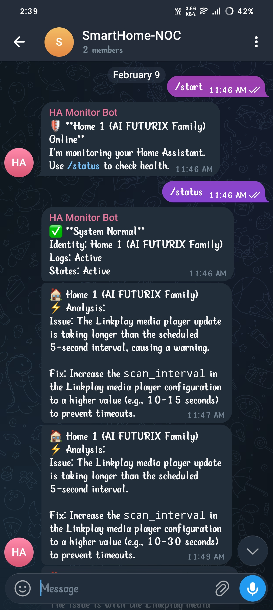

# HASentinel (bot-spylock automation)

HASentinel is an AI-powered automation and monitoring tool for Home Assistant. It acts as a guardian for your smart home by actively monitoring Home Assistant logs and entity states, analyzing issues using Large Language Models (LLMs), and actively interacting with you via Telegram.

## Core Features

- **Log Monitoring**: Continuously tails the `home-assistant.log` file for `ERROR`, `WARNING`, and `CRITICAL` entries to identify issues in real-time.
- **State Monitoring**: Connects directly to the Home Assistant WebSocket API to listen for state changes on specific devices (lights, switches, binary sensors).
- **AI Analysis**: Integrates with Groq (Llama 3.3) and Google Gemini to automatically analyze Home Assistant logs, suggest fixes, and respond to natural language questions about your home's state.
- **Telegram Bot Integration**: Sends real-time alerts and allows users to query the state of their home using a Telegram bot interface.
- **Auto-Failover**: Automatically attempts to reconnect to alternative Home Assistant WebSocket URLs if the primary connection fails.

## Prerequisites

- Python 3.8+
- Active Home Assistant instance with a Long-Lived Access Token.
- Telegram Bot Token.
- API Key for Groq or Google Gemini.

## Installation

1. Clone or download the repository to your local machine.
2. Install the required dependencies:

   ```bash
   pip install -r requirements.txt
   ```

## Configuration

The application uses environment variables for configuration. Create a `.env` file in the project directory with the following variables:

```env
# Home Assistant Config
HASS_TOKEN=your_long_lived_access_token
HASS_URL=ws://localhost:8123/api/websocket
HASS_API_URL=http://localhost:8123/api
HASS_LOG_FILE=/config/home-assistant.log
INSTANCE_NAME=HASentinel

# Telegram Config
TELEGRAM_TOKEN=your_telegram_bot_token
TELEGRAM_CHAT_ID=your_chat_id # Optional, bot will learn from first interaction

# AI Provider Config (Provide at least one)
GROQ_API_KEY=your_groq_api_key
LLM_API_KEY=your_gemini_api_key

# Additional Settings
LOG_KEYWORDS=ERROR,WARNING,CRITICAL
```

## Running the Application

1. Start the application by running:

   ```bash
   python monitor_ha.py
   ```

2. Open Telegram and send `/start` to your bot to begin receiving alerts.

## Example Telegram Interaction



**User**: `/start`

**Bot**:
> 🛡 **Home 1 (AI FUTURIX Family) Online**
> I'm monitoring your Home Assistant.
> Use /status to check health.

**User**: `/status`

**Bot**:
> ✅ **System Normal**
> Identity: Home 1 (AI FUTURIX Family)
> Logs: Active
> States: Active

**Bot (Automated Alert)**:
> 🏠 **Home 1 (AI FUTURIX Family)**
> ⚡ Analysis:
> Issue: The Linkplay media player update is taking longer than the scheduled 5-second interval, causing a warning.
> 
> Fix: Increase the `scan_interval` in the Linkplay media player configuration to a higher value (e.g., 10-15 seconds) to prevent timeouts.

## Project Structure

- `monitor_ha.py`: The main entry point. Manages the connection to Home Assistant, log monitoring, state fetching, and triggering alert actions.
- `telegram_bot.py`: Handles Telegram bot operations, incoming messages, and queuing asynchronous alerts to avoid rate constraints.
- `llm_handler.py`: Manages interactions with AI providers (Groq and Gemini) for log analysis and contextual natural language responses.
- `requirements.txt`: Python package dependencies for the project.
- `PROJECT-INTERNAL BOT.pdf`: Additional internal project documentation details.
